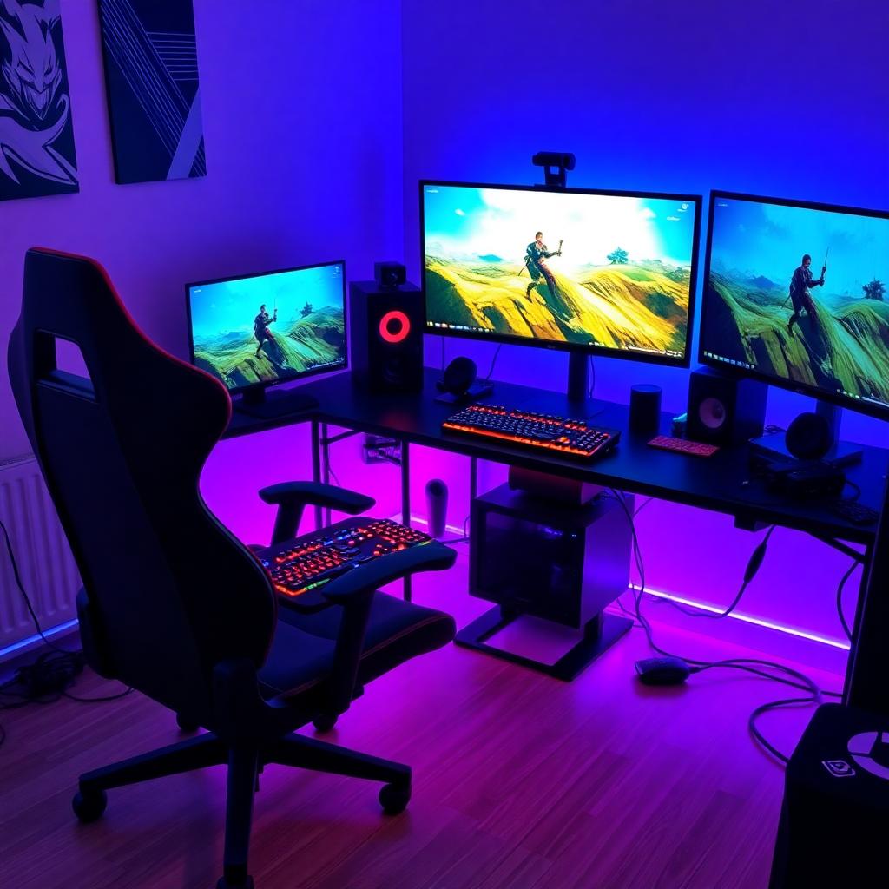

# GameArena

A dark-themed, single-page gaming/esports landing page built with HTML, CSS, and Bootstrap 5. GameArena showcases featured games, esports tournaments, the team behind the platform, and a contact section — styled around a bold "ultimate gaming" aesthetic.



## Features

- **Responsive navbar** with scrollspy — highlights the active section (Home, Our Games, What We Do, Our Team, Contact Us) as you scroll
- **Hero section** with a bold headline and background artwork
- **Our Games** — a carousel of featured/latest games
- **Esports highlights** — tournament imagery (e.g. Dota 2 The International, CS Major, League of Legends Worlds)
- **What We Do** section outlining the platform's value proposition
- **Our Team** section with member avatars
- **Contact section**
- **Dark theme** via Bootstrap's `data-bs-theme="dark"`
- Icons via Font Awesome, custom fonts (Chakra Petch, Days One)

## Tech Stack

- **HTML5** — single-page markup (`index.html`)
- **CSS3** — custom styling and layout (`css/style.css`, `css/media.css`)
- **[Bootstrap 5](https://getbootstrap.com/)** — grid, components, and dark theme (`css/bootstrap.min.css`, `js/bootstrap.bundle.min.js`)
- **Font Awesome** — icon set (`css/all.min.css`, `webfonts/`)
- **Custom fonts** — Chakra Petch, Days One (`fonts/`)

No build tools or package manager are required — this is a static site with vendored dependencies.

## Project Structure

```
GameArena/
├── index.html              # Main page markup
├── css/
│   ├── bootstrap.min.css     # Bootstrap framework
│   ├── all.min.css            # Font Awesome
│   ├── style.css              # Custom styles
│   └── media.css              # Responsive/media-query styles
├── js/
│   └── bootstrap.bundle.min.js  # Bootstrap JS (navbar, carousel, scrollspy)
├── fonts/                    # Custom TTF fonts
├── webfonts/                 # Font Awesome web fonts
└── images/                   # Hero art, game covers, avatars, tournament/logo images
```

## Getting Started

Since this is a static site, no installation or build step is needed.

1. Clone the repository
   ```bash
   git clone https://github.com/Abdelrahmanrefaat20/GameArena.git
   cd GameArena
   ```
2. Open `index.html` directly in your browser, or serve it locally:
   ```bash
   npx serve .
   ```
   (or use any static server / the VS Code "Live Server" extension)

## Customization

- **Content**: edit game listings, team members, and copy directly in `index.html`.
- **Colors & theme**: custom color variables (e.g. `var(--col-lemon)`) and overrides live in `css/style.css`.
- **Carousel**: the "Our Games" carousel is powered by Bootstrap's carousel component (`#gamesCarousel`) — add/remove slides by editing its markup.
- **Images**: replace files in `images/` with your own, keeping filenames or updating `src` attributes accordingly.

